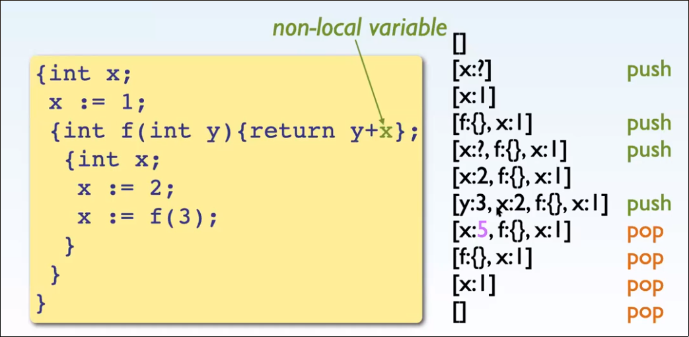

# Quiz 4 Learning Notes

Scope: all locations in a program where a symbol is visible

### Blocks
- a group of declarations and 
	- a sequence of statements (for imperative programming) or 
	- an expression (functional programming)

#### Locals and Non-Locals
- a local variable is defined in the same block
- a non-local is not defined in the same block
```
{	int x
	x := 10;
	y := 11;
	{ 	int y;
		y = 99;
	}
}
```
- above, `y` in the inner block is used as a local. It's value **shadows** (i.e. replaces) the non-local declared on line 3. 
- locals are kept in memory blocks called activation records, on the runtime stack

### Dynamic Scoping
- when calling a function that uses a non-local variable in its declaration, the most recent activation record of that variable name is the one that comes in to play when the function is called.



### Static Scoping
- variables in function implementations are required to be visible (i.e. in scope) at the implementation / definition, not at call time. 
- essentially implemented by storing an "access link" (pointer) to the activation record to the variable(s) used in the function, in that function's activation record.
	- you can follow variable access links at runtime to get values or
	- you can push activation record for f on to the stack pointed to by the activation record (i.e. temporary stack)
